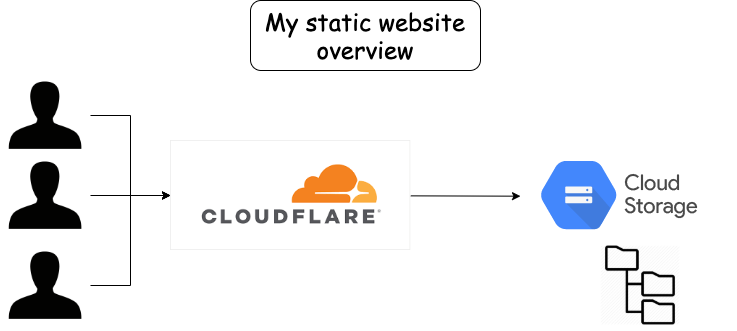

# Personal_Website 💻 
www.pierre-alexandre.io

## Description
Source code for my personnal website where I am sharing my personnal projects. 
This website is 100% static and updated on a regular basis. I am also using my personnal website to learn more about SEO and search engine related topics and improve my web design skills.  

## Architecture

## Roadmap
- Update profile picture 
- Make UI design changes for the "About Me" section
- Add the search engine project
- Add a blank target for every links
- Redesign some of the buttons (color and hover effect) 
- Add a news section with personnal articles / videos