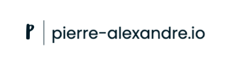

  
  
  
  
  
   

<h2 align="center">Personal website and portfolio</h2>

- Production website (Google Cloud Storage): [pierre-alexandre.io](https://pierre-alexandre.io)
- Staging website (Github Pages): [pierre-alexandre35.github.io/pierre-alexandre.io](https://pierre-alexandre35.github.io/pierre-alexandre.io/public_html/)

## Description
Source code for my personnal website where I am sharing my personnal projects. 
This website is 100% static and updated on a regular basis. I am also using my personnal website to learn more about SEO and search engine related topics and improve my web design skills.  

## Architecture

## Roadmap
- Update profile picture 
- Make UI design changes for the "About Me" section
- Add the search engine project
- Add a blank target for every links
- Redesign some of the buttons (color and hover effect) 
- Add a news section with personnal articles / videos